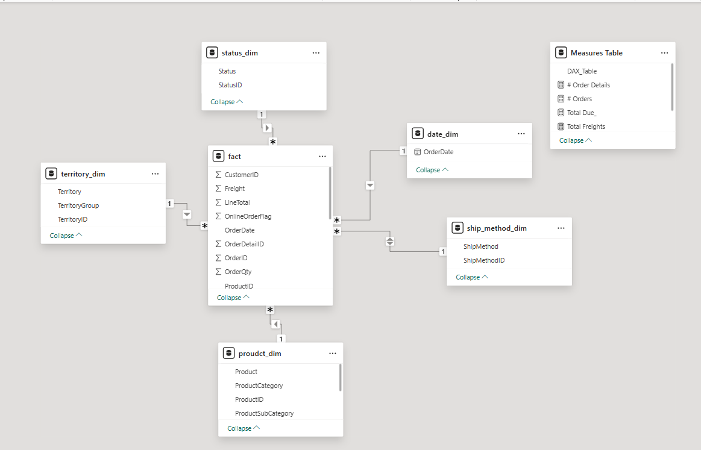

# 📊 Sales Performance Dashboard | Power BI

## 🚀 Project Overview

An interactive **Sales Performance Dashboard** built using Power BI to analyze business performance across orders, products, and territories.

The dashboard provides a comprehensive view of key metrics, enabling stakeholders to monitor trends, identify top-performing segments, and support data-driven decisions.

---

## 🎯 Business Objectives

* Track overall sales performance and operational metrics
* Analyze order trends over time
* Identify top-performing product categories and subcategories
* Evaluate regional performance across different territories
* Monitor order status distribution

---

## 📊 Dashboard Features

### 🔢 KPI Cards

* **Number of Orders:** 1,465
* **Total Freight:** 915.97K
* **Number of Order Details:** 24K
* **Total Subtotal:** 30.09M
* **Total Tax:** 2.93M
* **Total Due:** 33.93M

---

### 📈 Time Analysis

* Orders trend over time using **Order Date**
* Helps identify seasonality and demand fluctuations

---

### 🧾 Product Analysis

* **Total Tax by Product Category**
* **Order Quantity by Product Subcategory**
* Highlights top-performing products (e.g., Road Bikes, Jerseys)

---

### 🌍 Territory Analysis

* Total Due and Number of Orders across regions:

  * Canada
  * Northwest
  * France
  * United Kingdom
  * Germany
  * Australia

---

### 🔄 Order Status Analysis

* Distribution of orders by status:

  * Approved
  * In Process
  * Shipped
  * Cancelled
  * Rejected
  * Backordered

---

## 🧱 Data Model (Star Schema)

The project follows a **Star Schema design** for optimized performance and scalability:

* **Fact Table:**

  * `fact` (Orders & Order Details)

* **Dimension Tables:**

  * `date_dim`
  * `product_dim`
  * `territory_dim`
  * `status_dim`
  * `ship_method_dim`

* **Measures Table:**

  * Centralized DAX calculations (Orders, Total Due, Freight, etc.)

---

## 🛠️ Tools & Technologies

* Power BI Desktop
* Power Query (ETL & Data Cleaning)
* DAX (Data Analysis Expressions)
* Data Modeling (Star Schema Design)

---

## 🧠 Key Insights

* Canada generates the highest total revenue and order volume
* Road Bikes are the top-selling subcategory
* Sales show fluctuations indicating possible seasonal trends
* A noticeable portion of orders are still "In Process", indicating operational delays

---

## 📸 Dashboard Preview



---


## 📁 Repository Structure

```id="h3k92a"
├── dashboard.pbix
├── images/
│   └── dashboard.png
├── README.md
```

---


## 👤 Author

**Mohamed**
Aspiring Data Analyst | Power BI Developer

---
