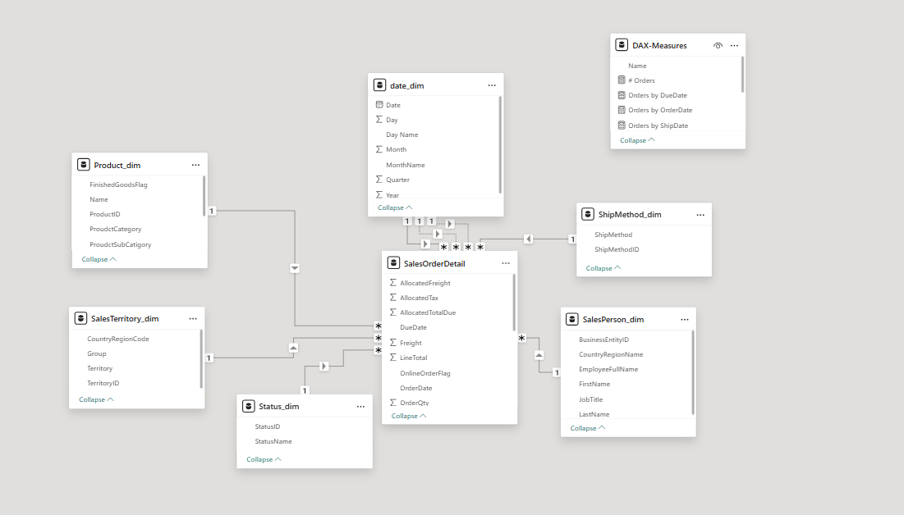

# 📊 Executive Sales Performance Dashboard | Power BI

## 🚀 Project Overview

This project presents an **Executive-Level Sales Dashboard** designed to provide high-level insights into business performance.

The dashboard enables decision-makers to quickly monitor KPIs, analyze sales trends, and evaluate performance across multiple dimensions such as time, product categories, and territories.

---

## 🎯 Business Objectives

* Provide a high-level overview of sales performance
* Monitor key financial metrics (Revenue, Tax, Freight, Orders)
* Analyze sales trends across different date types
* Compare online vs. in-store sales performance
* Evaluate regional and product category performance

---

## 📊 Dashboard Highlights

### 🔢 Key KPIs

* **Total Orders:** 31K
* **Total Subtotal:** 109.85M
* **Total Tax:** 10M
* **Total Freight:** 3M
* **Total Due:** 123.22M

---

### 📈 Sales Timeline Analysis

* Tracks orders using:

  * Order Date
  * Due Date
  * Ship Date
* Enables deeper understanding of operational flow and delays

---

### 🚚 Shipping Analysis

* Orders distribution by **Ship Method**
* Helps identify dominant logistics channels

---

### 🌐 Sales Channel Analysis

* Comparison between:

  * **Online Sales**
  * **Personnel (Offline) Sales**
* Identifies the most effective sales channel

---

### 📦 Product Category Analysis

* Quantity distribution across categories:

  * Bikes
  * Clothing
  * Accessories
  * Components

---

### 🌍 Territory Performance

* Combined analysis of:

  * Number of Orders
  * Total Revenue
* Across multiple regions (e.g., Australia, Southwest, Canada, etc.)

---

### 🛒 Online Order Behavior

* Analysis of orders based on **OnlineOrderFlag**
* Highlights customer purchasing behavior

---

### 🎛️ Interactive Features

* Dynamic filters (Slicers):

  * Date Range
  * Product Category
* Fully interactive visuals for drill-down analysis

---

## 🧱 Data Modeling Approach

* Implemented a **Star Schema** design
* Fact table connected to multiple dimension tables
* Optimized for performance and scalability

---

## 🛠️ Tools & Technologies

* Power BI Desktop
* Power Query (Data Transformation)
* DAX (Advanced Calculations)
* Data Modeling (Star Schema Design)

---

## 🧠 Key Insights

* Online sales significantly outperform offline channels
* Bikes category dominates total sales volume
* Certain territories consistently generate higher revenue
* Sales trends indicate strong growth over time with seasonal variations

---

## 📸 Dashboard Preview




---


## 📁 Repository Structure

```id="lq92md"
├── executive-dashboard.pbix
├── images/
│   └── executive-dashboard.png
├── README.md
```


## 👤 Author

**Mohamed**
Data Analyst | Power BI Developer

---
