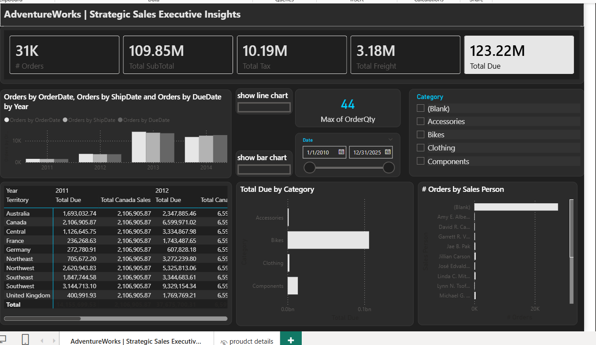
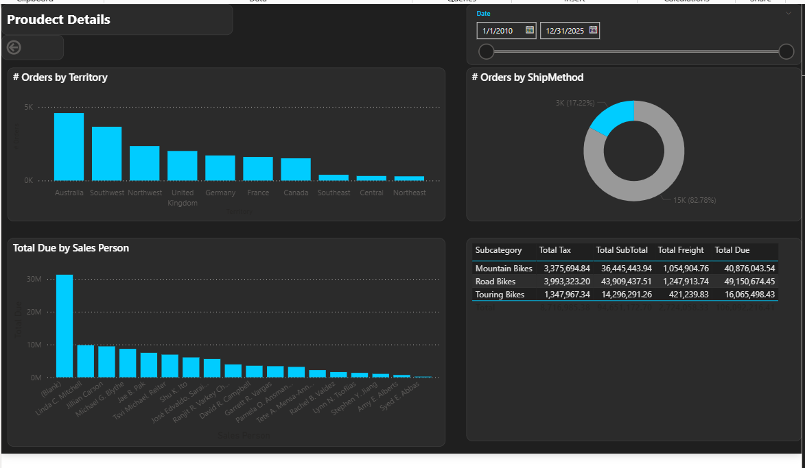
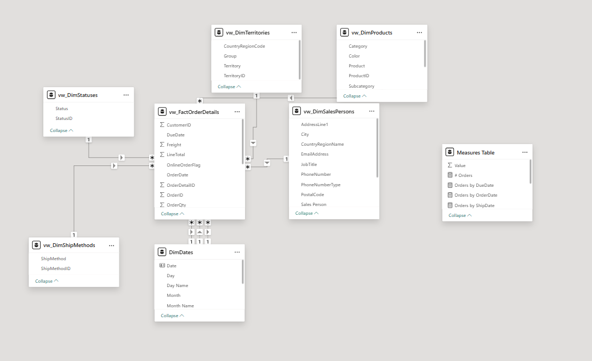

# 📊 Strategic Sales Executive Insights | Power BI

## 🚀 Overview
An **Executive Sales Dashboard with Drill-Through** built in Power BI to monitor KPIs and enable deeper analysis across products, regions, and sales performance.

---

## 🎯 Objectives
- Track key sales KPIs  
- Analyze trends across Order, Due, and Ship dates  
- Evaluate performance by category, territory, and salesperson  
- Enable detailed insights via drill-through  

---

## 📊 Key KPIs
- **Orders:** 31K  
- **Subtotal:** 109.85M  
- **Tax:** 10.19M  
- **Freight:** 3.18M  
- **Total Due:** 123.22M  

---

## 📈 Dashboard Features
- **Sales Trends:** Order vs Due vs Ship date  
- **Category Analysis:** Bikes, Clothing, Accessories, Components  
- **Salesperson Performance:** Orders distribution  
- **Territory Insights:** Regional performance comparison  
- **Shipping Analysis:** Orders by ship method  
- **Filters:** Date range + Category slicers  
- **Interactive visuals** with cross-filtering  

---

## 🔍 Drill-Through (Product Details)
Provides deeper insights into:
- Orders by territory  
- Orders by ship method  
- Revenue by salesperson  
- Subcategory-level financial breakdown  

---

## 🧱 Data Model
- Star schema design  
- Fact table + dimension tables (Date, Product, Territory, Salesperson)  

---

## 🛠️ Tools
- Power BI  
- Power Query  
- DAX  

---

## 🧠 Key Insights
- Bikes drive the highest revenue  
- Few salespeople contribute most sales  
- Top regions: Australia & Southwest  
- Sales trend shows growth then stabilization  

---

## 📸 Preview






---

## 📁 Structure
```
├── strategic-sales-dashboard.pbix
├── images/
├── README.md
```

---

## 👤 Author
**Mohamed**  
Power BI Developer  
