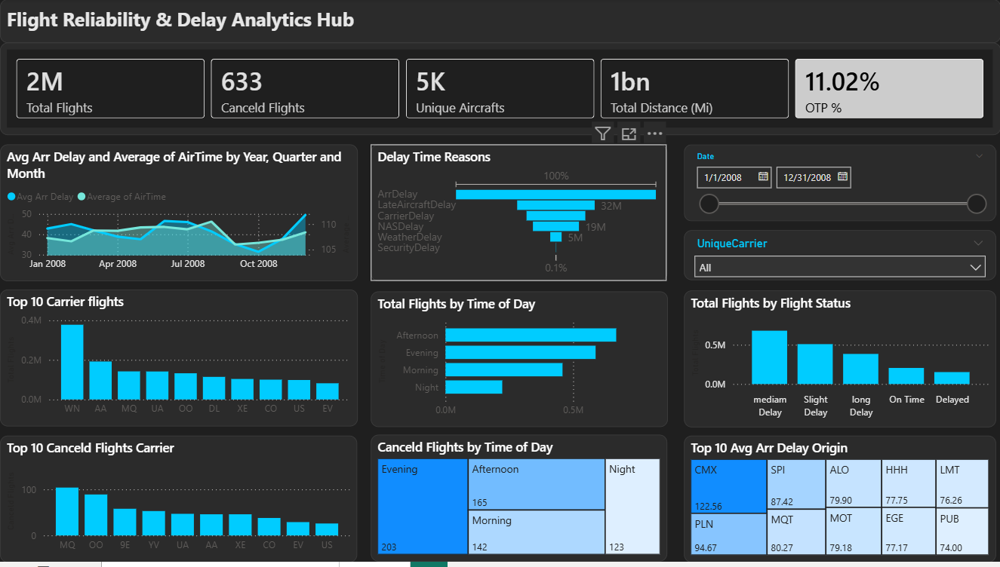
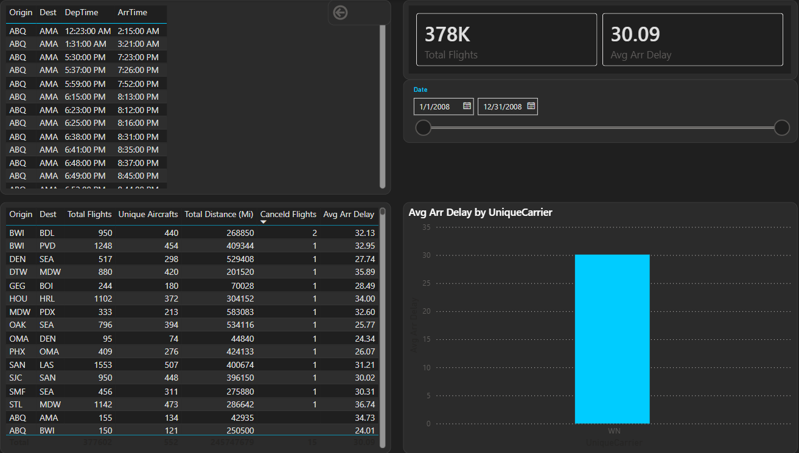

# ✈️ Flight Reliability & Delay Analytics Hub

An end-to-end **Power BI** project focused on analyzing airline operational efficiency, delay root causes, and service disruptions. This dashboard processes a high-volume dataset of **2 Million+ flight records** to deliver actionable aviation insights.

---

## 📊 Business Intelligence Overview
This project transforms raw flight data into a strategic decision-making tool. Key achievements include:
* **Massive Data Handling:** Analyzed over **2M rows** using optimized Star Schema modeling.
* **Service Quality Tracking:** Monitored On-Time Performance (OTP) and cancellation trends.
* **Fleet Insights:** Analyzed performance for **5,000+ unique aircraft** across **1 Billion+ miles**.

## 🚀 Key Features
* **Executive Summary:** Real-time KPI tracking for total volume, reliability, and distance.
* **Root Cause Analysis:** Dynamic breakdown of delays (Carrier, Weather, NAS, Security, Late Aircraft).
* **Temporal Trends:** Area charts identifying seasonal and monthly performance spikes.
* **Geographical Mapping:** Tree-maps highlighting top delayed origins (e.g., CMX, PLN).
* **Advanced Navigation:** Integrated **Drill-through** functionality for granular flight-level audits.
* **Modern UI/UX:** Solar-Dark theme optimized for professional environments and reduced eye strain.

## 🛠️ Technical Stack
* **Tool:** Power BI Desktop (optimized for Report Server).
* **Modeling:** Star Schema with dedicated Calendar and Carrier dimensions.
* **Analytics:** Advanced DAX measures for dynamic time-intelligence and KPI calculations.
* **Data Prep:** Power Query for automated data cleaning and transformation.

## 📐 Analytics Logic (DAX)
The core logic for measuring reliability is calculated as follows:

$$OTP \% = \frac{CALCULATE(TotalFlights, ArrDelay \le 0)}{TotalFlights}$$

## 📂 Project Structure
* `/Report`: Contains the `.pbix` file.
* `/images`: High-resolution captures of the Dashboard and Drill-through pages.

## 📸 Dashboard Preview

| Main Dashboard | Detailed Drill-through |
| :--- | :--- |
| 
 |

## 💡 Business Questions & Insights
The dashboard is designed to answer critical operational questions for airline management:

| Question | Insight / Answer |
| :--- | :--- |
| **What is the overall fleet reliability?** | The **OTP (On-Time Performance)** is currently **11.02%**, indicating a significant need for schedule optimization or buffer time adjustments. |
| **When are flights most likely to be canceled?** | Analysis shows that the **Evening** period experiences the highest volume of cancellations (**203 cases**), likely due to accumulated delays throughout the day. |
| **What is the primary driver of flight delays?** | The **Delay Time Reasons** chart reveals that **Late Aircraft** and **Carrier Delays** are the leading causes, suggesting issues with fleet rotation and maintenance. |
| **Which airports are operational bottlenecks?** | **CMX (Houghton County)** and **PLN (Pellston)** are the top origins for delays, with average arrival delays exceeding **90-120 minutes**. |
| **Who is the most active carrier with the best/worst volume?** | **WN (Southwest Airlines)** dominates the volume with over **0.4M flights**, while **MQ** and **OO** show the highest cancellation rates. |
| **Is there a correlation between distance and delay?** | By analyzing **1 Billion+ miles**, the dashboard helps identify if long-haul flights are more prone to delays compared to short-haul regional hops. |

---

## 🔍 Deep-Dive: Drill-through Capability
One of the most powerful features of this project is the **Drill-through** page. It allows users to:
1. Right-click on a specific **Carrier** or **Airport**.
2. Navigate to a detailed **Flight Log**.
3. View specific **Departure/Arrival times** and individual flight distances to audit the exact cause of a KPI drop.

---
**Developed by Mohamed** *Data Analyst & Developer*
